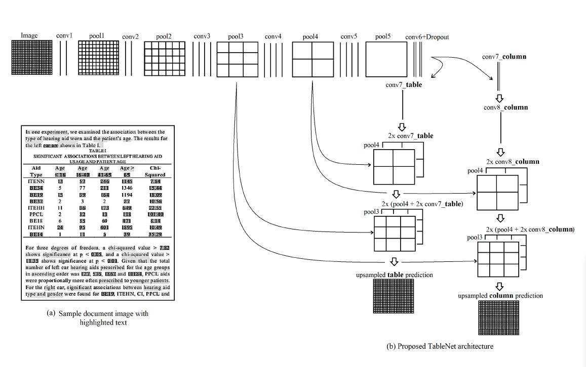
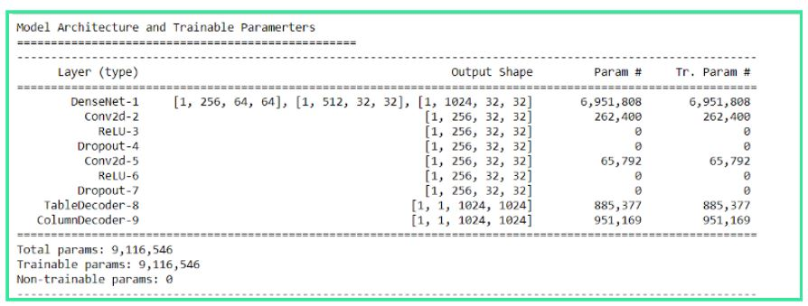
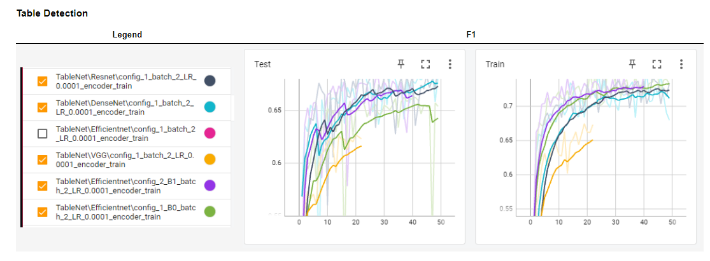
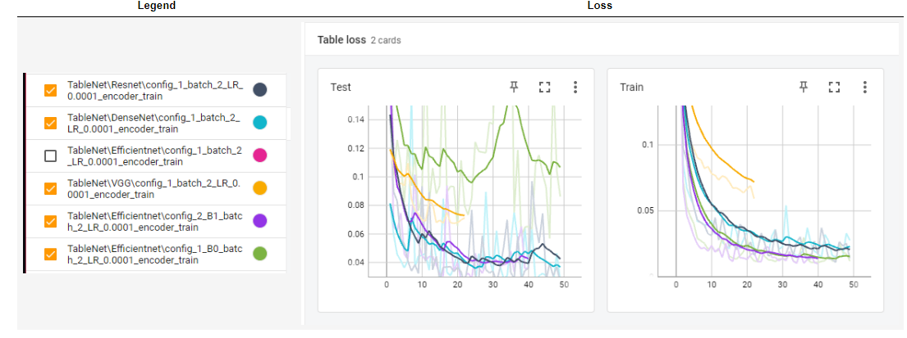
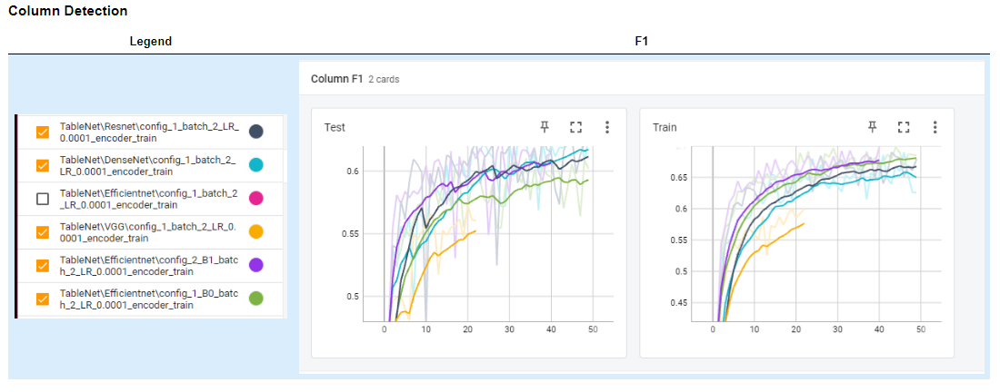
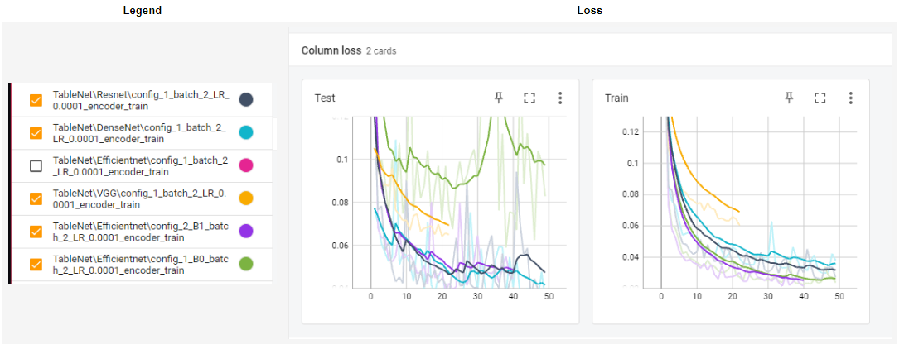
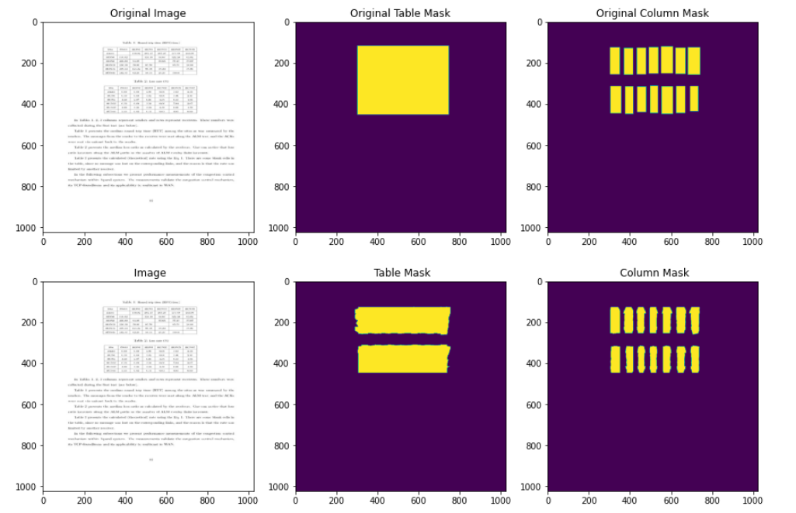
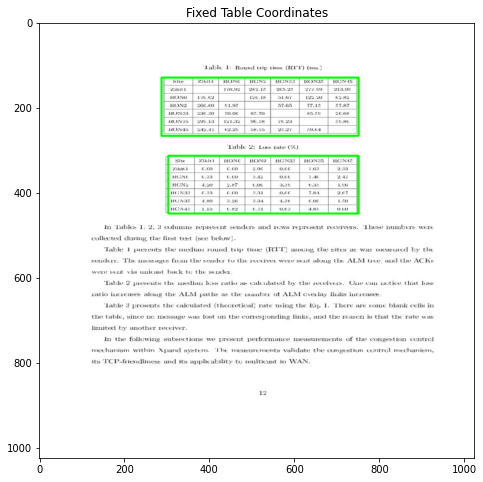
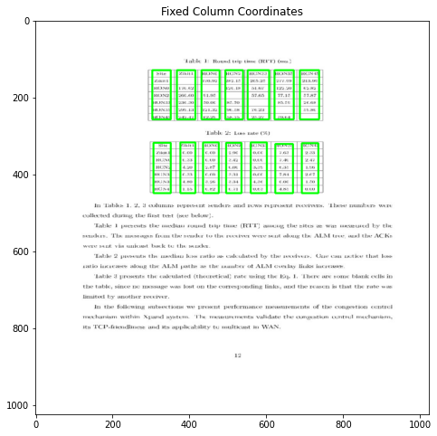
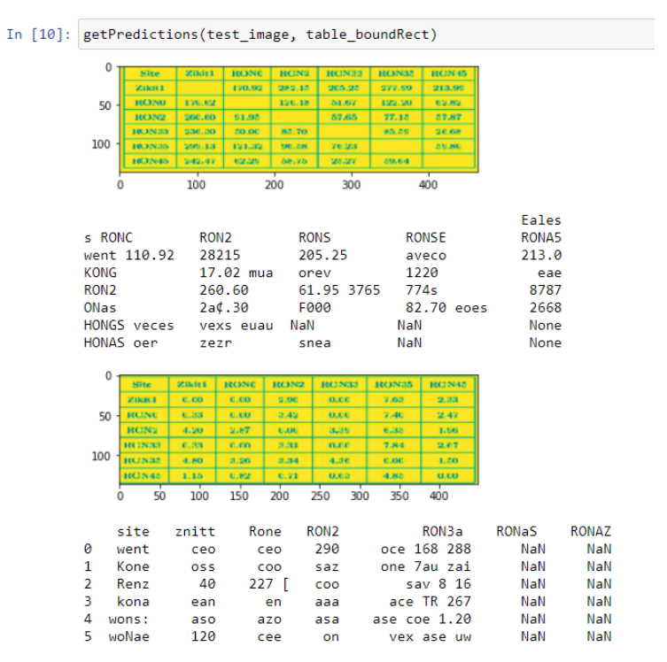

# TableNet-pytorch
Pytorch Implementation of TableNet 
Research Paper : https://arxiv.org/abs/2001.01469

## My Comprehension
[What is Computer Vision?](https://www.youtube.com/watch?v=-4E2-0sxVUM)

[Medium Article](https://asagar60.medium.com/tablenet-deep-learning-model-for-end-to-end-table-detection-and-tabular-data-extraction-from-b1547799fe29) used as Guide for [TableNet](https://arxiv.org/pdf/2001.01469.pdf)

Segmentation: [What is Semantic Segmentation?](https://www.youtube.com/watch?v=5QUmlXBb0MY)

[what are Masks and Contours in Computer Vision?](https://www.google.com/search?q=what+are+masks+and+contours+computer+vision&oq=what+are+masks+and+contours+computer+vision&gs_lcrp=EgZjaHJvbWUyBggAEEUYOdIBCDM4ODhqMGo0qAIAsAIA&sourceid=chrome&ie=UTF-8)
### why RNNs?
#### Can Bag of Words Effectively Do Sentiment Analysis on These Sentences?

**He is a good boy**

**Not boy is not bad**

**She is not a bad girl**

The bag of words (BoW) model can be used for sentiment analysis, but it may not capture the nuances present in the given sentences effectively. Let's see how the BoW model represents these sentences:

- **"He is a good boy"**:
  - BoW representation: {he, is, a, good, boy}
  - Frequency representation: {1, 1, 1, 1, 1}
  - Sentiment: The BoW representation doesn't explicitly capture the sentiment, but it contains positive words like "good," which may indicate a positive sentiment.

- **"Not boy is not bad"**:
  - BoW representation: {not, boy, is, bad}
  - Frequency representation: {2, 1, 1, 1}
  - Sentiment: The BoW representation counts the word "not" twice, which may skew the sentiment analysis. It doesn't differentiate between "not bad" and "bad."

- **"She is not a bad girl"**:
  - BoW representation: {she, is, not, a, bad, girl}
  - Frequency representation: {1, 1, 1, 1, 1, 1}
  - Sentiment: Similar to sentence 2, the BoW representation counts the word "not," but it doesn't capture the sentiment of "not bad."

While the BoW model can provide some insights into sentiment analysis, it may not be sufficient for nuanced understanding. More advanced techniques, such as word embeddings or deep learning models like recurrent neural networks (RNNs) or transformers, are better suited for sentiment analysis tasks as they can capture semantic relationships and contextual information more effectively.

### How do RNNs actually Work?
[Krish Naik Explains ForwardPass in RNNs](https://www.youtube.com/watch?v=u8utlK_c5C8)

### Similarly for LSTMs
[StatsQuest for LSTMs](https://www.youtube.com/watch?v=YCzL96nL7j0&list=PLblh5JKOoLUIxGDQs4LFFD--41Vzf-ME1&index=17)

Check out how Neural Nets consider Context to develop an inituition about words considered. [Word Embeddings and Word2Vec](https://www.youtube.com/watch?v=viZrOnJclY0&list=PLblh5JKOoLUIxGDQs4LFFD--41Vzf-ME1&index=17)

[Seq2Seq and Encoder-Decoder model](https://www.youtube.com/watch?v=L8HKweZIOmg&list=PLblh5JKOoLUIxGDQs4LFFD--41Vzf-ME1&index=18)

## Convolutional Neural Networks (CNNs)

CNNs are a type of deep neural network specifically designed for processing and analyzing visual data, such as images. They consist of multiple layers, each with its own specific function in extracting and learning features from the input data.

### Image Processing Pipeline

CNNs operate on an image processing pipeline where the input images are passed through a series of layers before reaching the final output layers, often referred to as the "blackbox".

### Feature Extraction

These layers are responsible for converting the input images into meaningful representations called "feature maps". Feature maps capture different aspects of the input data, such as edges, textures, or higher-level patterns.

### Data Representation

Since neural networks operate on numerical data, images are converted into multidimensional arrays (tensors) where each value represents the intensity or color of a pixel.

### Convolution, Padding, and Pooling

- **Convolution:** Convolutional layers apply a set of learnable filters, also known as kernels, across the input image to extract local patterns and features.
- **Padding:** Padding layers add additional border pixels to the input image to ensure that the spatial dimensions of the feature maps remain consistent throughout the convolutional operation.
- **Pooling:** Pooling layers downsample the feature maps by aggregating information from local regions.

### Kernel Filters

Kernels, or filters, are small matrices applied to the input image during the convolution operation. Each kernel specializes in detecting specific patterns or features within the image.

### Flattening or Pooling

After the series of transformations performed by the convolutional layers, the output is typically flattened or pooled to create a vector representation of the extracted features.

### Fully Connected Layers

The flattened or pooled feature vector is then passed to one or more fully connected layers, connecting every neuron in one layer to every neuron in the next layer.

### Activation Functions

Each neuron in the fully connected layers typically applies an activation function to introduce non-linearity into the network.

### Output Layer

The final fully connected layer(s) in the network often lead to an output layer, which produces the network's predictions or outputs.

### Loss Function and Optimization

The output from the network is compared to the ground truth labels using a loss function, and optimization algorithms are used to adjust the network parameters to minimize the loss and improve the model's performance.

### Table Row Extraction 
Scroll down to Table Row Extraction at [Kaggle](https://www.kaggle.com/code/ritvik1909/tablenet)

<!-- CNNs can be understood as Images beign passed through a series of additional layers before finally into the "blackbox". 

these layers are responsible to convert and generate "Feature maps" from the inputs they receive, i.e Images!!!

Since, Algos/NNs understand nothing but numbers, the images are converted onto multidimensional arrays (even though they exist as multidimensional arrays, i'm mentioning it for the sake of my understanding). also looking at images with resolution of 256 X 256 and above, the number of inputs to be handled is quite impractical.

Hence, we utilize convolution, padding and pooling. these are performed by convolution, padding and pooling layers respectively. each one of them either captures certain features and generate feature maps which are nothing but projections(in a way) of the features captured, and/or reduce the overall image size.

these layers makes use of filters know as "Kernels" in order to create feature maps.  -->

[Overview of how CNNs works](https://www.youtube.com/watch?v=-4E2-0sxVUM)

[How exaclty do CNNs work WRT feature maps, by Far1Din](https://www.youtube.com/watch?v=jDe5BAsT2-Y)

[Also Checkout 3Blue1Brown](https://www.youtube.com/watch?v=KuXjwB4LzSA)

[CNNs and architectures such as DenseNet and VGG](https://youtube.com/watch?v=cFgASecJGo8&list=PLyqSpQzTE6M-SISTunGRBRiZk7opYBf_K&index=50)

## About the Model TableNet
[Gemini Chat Link](https://gemini.google.com/app/a111ab3f33da3815)

[GPT Chat Link](https://chat.openai.com/share/3f38c5d6-210b-4023-b9e5-04095a7e3002)

TableNet leverages deep learning techniques, specifically a type of approach called [semantic segmentation](https://www.youtube.com/watch?v=5QUmlXBb0MY), to detect tables in an image.

It is an [Encoder-Decoder]() type model.

### Pre-trained Model Feature Extraction:

TableNet utilizes a pre-trained deep learning model, commonly VGG-19 (Here we use [DenseNet](https://towardsdatascience.com/understanding-and-visualizing-densenets-7f688092391a)), as the foundation/Encoder. This pre-trained model has already been exposed to a massive dataset of images and tasks, allowing it to recognize underlying patterns and features within the input image. When presented with an image containing a table, VGG-19 extracts these informative features, essentially creating a map that highlights important edges, shapes, and color variations.

### Decoder Branches for Segmentation:

TableNet then diverges from the pre-trained model and employs two decoder branches specifically designed for table detection. Each branch receives the extracted features from VGG-19 as input.

1. **Table Segmentation Branch**: This branch focuses on identifying the overall table region. It analyzes the features and learns to differentiate between areas containing the table structure (grids, lines, text clusters) and the background of the image. The output of this branch is a probability map where each pixel is assigned a value indicating the likelihood of belonging to the table region.

2. **Column Detection Branch**: Similarly, this branch specializes in identifying columns within the table. It analyzes the features and learns to distinguish between vertical structures present within the table region.

### Identifying Table Region:

Based on the probability map generated by the table segmentation branch, a threshold is applied to determine the final table region. Pixels exceeding the threshold are classified as part of the table, effectively creating a mask that outlines the table's location within the image. Essentially, TableNet trains these decoder branches to become specialists in recognizing table-like features. By analyzing the informative map created by VGG-19, the table segmentation branch learns to pinpoint the most probable table region in the image.

### Infering Rows
The model trains on bitmaps and masks to identify table regions in an image and strip it vertically, down into columns.

Later, TableNet analyzes the distribution of content within each column. It looks at where the text lines are located vertically within each column.

Look for an Example of Column 'A' in [GPT Chat Link](https://chat.openai.com/share/3f38c5d6-210b-4023-b9e5-04095a7e3002).

This is how TableNet indentifies Table and Table Structure in an image.

### What exactly is convolution and How CNNs work.
This section should be focusing on [Convolution](https://www.youtube.com/watch?v=KuXjwB4LzSA) as a concept and how [Kernels or Filters](https://www.youtube.com/watch?v=jDe5BAsT2-Y) work in order to capture features from input image(or a feature map), how these operations affect the shapes of images and eventually looking into the [Forward and Backward propogation cycle](https://www.youtube.com/watch?v=Lakz2MoHy6o) of a CNN.

[GPT Link](https://chat.openai.com/share/ff537a5d-cf2b-481a-a577-d3a45f13e8c1)

[Gemini Link](https://gemini.google.com/app/4cfbdcf1e8794ab0)

## Description
In this project we will implement an end-to-end Deep learning architecture which will not only localize the Table in an image, but will also generate structure of Table by segmenting columns in that Table. After detecting Table structure from the image, we will use Pytesseract OCR package to read the contents of the Table.

To know more about the approach, refer my medium blog post,

Part 1: https://asagar60.medium.com/tablenet-deep-learning-model-for-end-to-end-table-detection-and-tabular-data-extraction-from-b1547799fe29

Part 2: https://asagar60.medium.com/tablenet-deep-learning-model-for-end-to-end-table-detection-and-tabular-data-extraction-from-a49ac4cbffd4

## Data
We will use both Marmot and Marmot Extended dataset for Table Recognition. Marmot dataset contains Table bounding box coordinates and extended version of this dataset contains  Column bounding box coordinates.

Marmot Dataset : https://www.icst.pku.edu.cn/cpdp/docs/20190424190300041510.zip
Marmot Extended dataset : https://drive.google.com/drive/folders/1QZiv5RKe3xlOBdTzuTVuYRxixemVIODp

Download processed Marmot dataset: https://drive.google.com/file/d/1irIm19B58-o92IbD9b5qd6k3F31pqp1o/view?usp=sharing

## Model
We will use DenseNet121 as encoder and build model upon it.

### Trainable Params

Download saved model : https://drive.google.com/file/d/1TKALmlwUM_n4gULh6A6Q35VPRUpWDmJZ/view?usp=sharing

### Performance compared to other encoder models ( Resnet18, EfficientNet-B0, EfficientNet-B1, VGG19 )

#### Table Detection - F1

#### Table Detection - Loss

#### Column Detection - F1

#### Column Detection - Loss

## Predictions

### Predictions from the model

### After fixing table mask using contours

### After fixing column mask using contours

### After processing it through pytesseract

## Deployed application 
https://vimeo.com/577282006

## Future Work
- [ ] Deploy this application on a remote server using AWS /StreamLit sharing/heroku.
- [ ] Model Quantization for faster inference time.
- [ ] Train for more epochs and compare the performances.
- [ ] Increase data size by adding data from ICDAR 2013 Table recognition dataset.

## References
1. [Table Net Research Paper](https://arxiv.org/abs/2001.01469)
2. [7 tips for squeezing maximum performance from pytorch](https://towardsdatascience.com/7-tips-for-squeezing-maximum-performance-from-pytorch-ca4a40951259)
3. [StreamLit](https://docs.streamlit.io/en/stable/)
4. [AppliedAI Course](https://www.appliedaicourse.com/course/11/Applied-Machine-learning-course)
